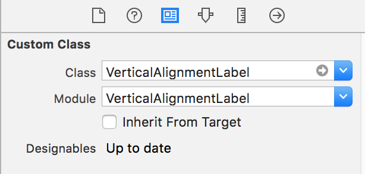
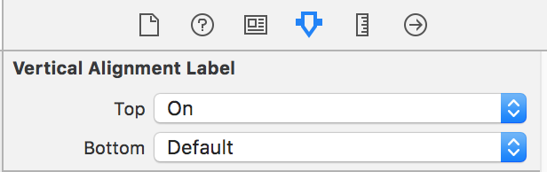

# VerticalAlignmentLabel

[](https://travis-ci.org/YukiKuroda/VerticalAlignmentLabel)
[](http://cocoapods.org/pods/VerticalAlignmentLabel)
[](http://cocoapods.org/pods/VerticalAlignmentLabel)
[](http://cocoapods.org/pods/VerticalAlignmentLabel)

This is a simple library that allows vertical alignment of UILabel.


## Usage

1. Set UILabel to Storyboard or XIB.
2. Change `Class` and `Module` of `Custom Class` in Identity Inspector to `VerticalAlignmentLabel`.
  

3. Select property of `Vertical Alignment Label` in Attributes Inspector.
  

### Programmatically

```swift
// var label: VerticalAlignmentLabel

label.verticalTextAlignment = .top
label.verticalTextAlignment = .center
label.verticalTextAlignment = .bottom
```

## Example

To run the example project, clone the repo, and run `pod install` from the Example directory first.

## Requirements

- Swift 3.0 or later
- iOS 8.0 or later

## Installation

VerticalAlignmentLabel is available through [CocoaPods](http://cocoapods.org). To install
it, simply add the following line to your Podfile:

```ruby
pod "VerticalAlignmentLabel"
```

## Author

darquro, yuki.kuro96@gmail.com

## License

VerticalAlignmentLabel is available under the MIT license. See the LICENSE file for more info.
